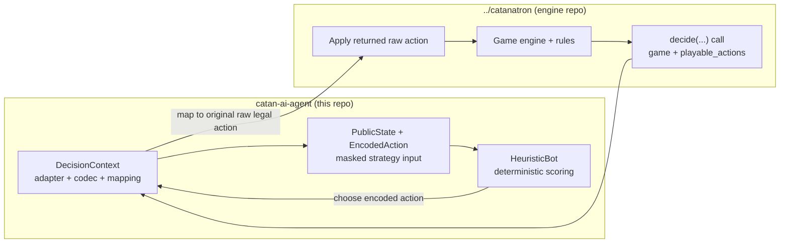

# Catan AI Agent Progress README

## What this repo is

- `catan-ai-agent` is an AI integration layer around the sibling `../catanatron` project.
- This repo **does not** implement or reimplement the Catan game engine.
- `../catanatron` provides the actual simulator: rules, legal action generation, game progression, CLI, and UI.
- This repo currently provides:
  - wrapper package structure (`catan_ai`)
  - environment/import verification utilities
  - simulator probe/debug scripts
  - hidden-information-safe adapter layer (`PublicState`, `ActionCodec`, adapter)
  - custom player implementations (`DebugPlayer`, `HeuristicBot`)



## Current project layout

```text
catan-ai-agent/
├── Phase1_README.md                    # This progress/status document
├── README.md                           # Main project README and setup notes
├── pyproject.toml                      # Package metadata (no direct PyPI catanatron pin)
├── reports/
│   └── simulator_notes_template.md     # Template for public/hidden info notes
├── scripts/
│   ├── cli_smoke.py                    # Environment + catanatron-play availability check
│   ├── sim_probe.py                    # Tick-by-tick simulator probe (up to 30 ticks)
│   ├── state_probe.py                  # Raw state/board/player inspection dump
│   ├── public_state_probe.py           # PublicState masked-view inspection
│   ├── run_debug_match.py              # DebugPlayer match and reproducibility smoke checks
│   └── run_heuristic_match.py          # HeuristicBot vs baselines
├── src/
│   └── catan_ai/
│       ├── __init__.py                 # Package entry
│       ├── adapters/
│       │   ├── __init__.py             # Adapter exports
│       │   ├── public_state.py         # PublicState / PublicPlayerSummary / EncodedAction
│       │   ├── catanatron_adapter.py   # Raw game/state -> PublicState adapter
│       │   └── action_codec.py         # Stable action encoding + deterministic ordering
│       ├── players/
│       │   ├── __init__.py             # Player exports
│       │   ├── debug_player.py         # Minimal custom Catanatron Player subclass
│       │   ├── decision_context.py     # One-turn encoded->raw action bridge
│       │   └── heuristic_player.py     # First real strategy bot using PublicState
│       └── utils/
│           ├── __init__.py
│           ├── logging.py              # Small logging helper
│           └── seeding.py              # Seed helper
└── tests/
    ├── test_imports.py                 # Import and basic game creation checks
    ├── test_debug_player.py            # DebugPlayer behavior and reproducibility checks
    ├── test_public_state.py            # PublicState masking/serializability checks
    ├── test_action_codec.py            # Action codec determinism checks
    └── test_heuristic_player.py        # HeuristicBot + decision bridge checks
```

## What has been completed so far

- Project scaffolding created with `src/` package layout and editable install support.
- Import/environment verification added (`tests/test_imports.py` + `scripts/cli_smoke.py`).
- `scripts/cli_smoke.py` confirms Python environment, `catanatron` import location, and `catanatron-play` availability.
- `scripts/sim_probe.py` runs a short game and prints per-tick action activity.
- `scripts/state_probe.py` dumps board/roads/buildings/player state/bank/game flags for inspection.
- `DebugPlayer` implemented as a real subclass of Catanatron `Player`.
- `scripts/run_debug_match.py` added to run integration matches and show repeated `decide()` calls.
- Reproducibility fix implemented for debug bot (deterministic action sorting before selection).
- Hidden-information-safe adapter layer implemented:
  - `PublicState` dataclass
  - `PublicPlayerSummary` dataclass
  - `public_state_from_game(game, acting_color)`
  - strict masking checks in tests
- Stable action representation implemented:
  - `ActionCodec.encode(...)`
  - deterministic ordering via `ActionCodec.sorted_actions(...)`
- Thin decision bridge implemented:
  - `DecisionContext` builds `PublicState`
  - deterministic encoded action list
  - stable `EncodedAction -> raw playable action` mapping
- First strategy bot implemented:
  - `HeuristicBot` scores legal actions from `PublicState` + `EncodedAction` only
  - deterministic tie-breaks
  - returns original raw legal action through `DecisionContext`
- Match runner for strategy bot added:
  - `HeuristicBot` vs `DebugPlayer`
  - `HeuristicBot` vs `RandomPlayer`
- Full suite currently passing (`41` tests).

## Relationship to ../catanatron

- The sibling `../catanatron` repo is required because it is the simulator and rule engine this repo calls into.
- This repo depends on the local editable install of `../catanatron` in the active virtual environment.
- For local development, this repo should not silently rely on an unintended PyPI `catanatron` version; use the sibling editable install so APIs and behavior match your local engine code.

## Setup instructions

```bash
# 1) Activate your virtual environment (example)
# Windows (PowerShell):
.\.venv\Scripts\Activate.ps1

# 2) Install sibling engine/simulator in editable mode
cd ../catanatron
pip install -e ".[web,gym,dev]"

# 3) Install this AI wrapper repo in editable mode
cd ../catan-ai-agent
pip install -e .

# 4) Run checks
pytest -q
python scripts/cli_smoke.py
```

## How to run each current script

### `scripts/cli_smoke.py`

- **What it does**
  - Prints basic environment information.
  - Verifies `catanatron` imports from the active environment.
  - Verifies `catanatron-play` is on `PATH`.
  - Performs quick `Game` construction sanity check.
- **Run**

```bash
python scripts/cli_smoke.py
```

- **Expected output (high level)**
  - Python/platform info
  - `catanatron imported OK`
  - `catanatron-play found at ...`
  - `Game created OK`

### `scripts/sim_probe.py`

- **What it does**
  - Creates a small game and steps through up to 30 ticks.
  - Prints tick number, current player, number of legal actions, chosen action.
- **Run**

```bash
python scripts/sim_probe.py
```

- **Expected output (high level)**
  - Tabular per-tick lines (`tick`, `player`, `#actions`, `action`)
  - Ends with winner line or "stopped after 30 ticks"

### `scripts/state_probe.py`

- **What it does**
  - Advances a game, then prints raw state summaries:
    - board summary
    - roads summary
    - buildings summary
    - player state summaries
    - bank/game flags
  - Useful for understanding public vs hidden information exposure.
- **Run**

```bash
python scripts/state_probe.py
```

- **Expected output (high level)**
  - Multiple labeled sections with tile/building/road/player/bank details

### `scripts/public_state_probe.py`

- **What it does**
  - Advances a game and builds `PublicState` for current acting player.
  - Pretty-prints the masked view used by future strategy logic.
  - Explicitly lists intentionally omitted hidden information.
- **Run**

```bash
python scripts/public_state_probe.py
```

- **Expected output (high level)**
  - Public board/player/action summaries
  - encoded legal actions
  - "Intentionally Omitted Information" section

### `scripts/run_debug_match.py`

- **What it does**
  - Runs deterministic `DebugPlayer` integration matches.
  - Prints winner, turn count, and call counts.
- **Run**

```bash
python scripts/run_debug_match.py
```

- **Expected output (high level)**
  - Match sections with per-match summary

### `scripts/run_heuristic_match.py`

- **What it does**
  - Runs `HeuristicBot` vs `DebugPlayer`.
  - Runs `HeuristicBot` vs built-in `RandomPlayer`.
  - Prints winner, turn count, and call counts.
- **Run**

```bash
python scripts/run_heuristic_match.py
```

- **Expected output (high level)**
  - Two match sections with summary lines

## Current tests

- `tests/test_imports.py` validates:
  - `catanatron` importability and key symbols
  - basic game creation from this repo
  - `catan_ai` package and utility imports
- `tests/test_debug_player.py` validates:
  - `DebugPlayer` instantiation
  - returned action is legal
  - deterministic sorted action selection
  - `reset_state` and call counting behavior
  - debug-vs-debug reproducibility (same seed => same turn count)
  - full game smoke run without crashing
- `tests/test_public_state.py` validates:
  - `PublicState` can be built from a real game
  - hidden opponent resource identities do not appear
  - hidden opponent unplayed dev-card identities do not appear
  - no hidden deck-order / hidden-VP leaks
  - `PublicState` structure remains serializable/simple
- `tests/test_action_codec.py` validates:
  - action encoding behavior
  - deterministic ordering across repeated calls
  - deterministic ordering for fixed-seed equivalent states
  - encoded-action hashability and decode formatting
- `tests/test_heuristic_player.py` validates:
  - `HeuristicBot` instantiation
  - always returns a legal raw playable action
  - deterministic for fixed seed
  - prefers non-`END_TURN` when clearly useful build exists
  - `DecisionContext` encoded->raw action mapping works
  - tiny full-game run completes without crashing

## Architecture boundary note

- Raw Catanatron game/state objects are read only in:
  - `src/catan_ai/adapters/catanatron_adapter.py`
  - `src/catan_ai/players/decision_context.py` (thin decision-call bridge)
- `HeuristicBot` decision logic consumes only:
  - `PublicState`
  - `EncodedAction`
- The final returned action is still one of the original raw `playable_actions` from the current `decide(...)` call.

## Known limitations

- `DebugPlayer` is intentionally non-strategic (integration-focused only).
- `HeuristicBot` is intentionally simple and transparent, not optimal.
- No MCTS, belief sampling, or learning pipeline yet.
- No player-to-player trading strategy logic yet.
- No dedicated human evaluation workflow/tooling yet.
