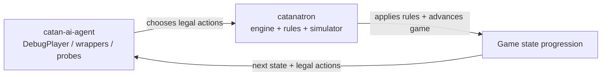

# Catan AI Agent Progress README

## What this repo is

- `catan-ai-agent` is an AI integration layer around the sibling `../catanatron` project.
- This repo **does not** implement or reimplement the Catan game engine.
- `../catanatron` provides the actual simulator: rules, legal action generation, game progression, CLI, and UI.
- This repo currently provides:
  - wrapper package structure (`catan_ai`)
  - environment/import verification utilities
  - simulator probe/debug scripts
  - a minimal custom `DebugPlayer` integration bot



## Current project layout

```text
catan-ai-agent/
├── Phase1_README.md                    # This progress/status document
├── README.md                           # Main project README and setup notes
├── pyproject.toml                      # Package metadata (no direct PyPI catanatron pin)
├── reports/
│   └── simulator_notes_template.md     # Template for public/hidden info notes
├── scripts/
│   ├── cli_smoke.py                    # Environment + catanatron-play availability check
│   ├── sim_probe.py                    # Tick-by-tick simulator probe (up to 30 ticks)
│   ├── state_probe.py                  # Raw state/board/player inspection dump
│   └── run_debug_match.py              # DebugPlayer match and reproducibility smoke checks
├── src/
│   └── catan_ai/
│       ├── __init__.py                 # Package entry
│       ├── players/
│       │   ├── __init__.py             # Player exports
│       │   └── debug_player.py         # Minimal custom Catanatron Player subclass
│       └── utils/
│           ├── __init__.py
│           ├── logging.py              # Small logging helper
│           └── seeding.py              # Seed helper
└── tests/
    ├── test_imports.py                 # Import and basic game creation checks
    └── test_debug_player.py            # DebugPlayer behavior and reproducibility checks
```

## What has been completed so far

- Project scaffolding created with `src/` package layout and editable install support.
- Import/environment verification added (`tests/test_imports.py` + `scripts/cli_smoke.py`).
- `scripts/cli_smoke.py` confirms Python environment, `catanatron` import location, and `catanatron-play` availability.
- `scripts/sim_probe.py` runs a short game and prints per-tick action activity.
- `scripts/state_probe.py` dumps board/roads/buildings/player state/bank/game flags for inspection.
- `DebugPlayer` implemented as a real subclass of Catanatron `Player`.
- `scripts/run_debug_match.py` added to run integration matches and show repeated `decide()` calls.
- Reproducibility fix implemented: deterministic action sorting before `DebugPlayer` picks an action.
- Test coverage added for instantiation, legal action return, sorted action choice, reproducibility check, and full-game smoke execution.

## Relationship to ../catanatron

- The sibling `../catanatron` repo is required because it is the simulator and rule engine this repo calls into.
- This repo depends on the local editable install of `../catanatron` in the active virtual environment.
- For local development, this repo should not silently rely on an unintended PyPI `catanatron` version; use the sibling editable install so APIs and behavior match your local engine code.

## Setup instructions

```bash
# 1) Activate your virtual environment (example)
# Windows (PowerShell):
.\.venv\Scripts\Activate.ps1

# 2) Install sibling engine/simulator in editable mode
cd ../catanatron
pip install -e ".[web,gym,dev]"

# 3) Install this AI wrapper repo in editable mode
cd ../catan-ai-agent
pip install -e .

# 4) Run checks
pytest -q
python scripts/cli_smoke.py
```

## How to run each current script

### `scripts/cli_smoke.py`

- **What it does**
  - Prints basic environment information.
  - Verifies `catanatron` imports from the active environment.
  - Verifies `catanatron-play` is on `PATH`.
  - Performs quick `Game` construction sanity check.
- **Run**

```bash
python scripts/cli_smoke.py
```

- **Expected output (high level)**
  - Python/platform info
  - `catanatron imported OK`
  - `catanatron-play found at ...`
  - `Game created OK`

### `scripts/sim_probe.py`

- **What it does**
  - Creates a small game and steps through up to 30 ticks.
  - Prints tick number, current player, number of legal actions, chosen action.
- **Run**

```bash
python scripts/sim_probe.py
```

- **Expected output (high level)**
  - Tabular per-tick lines (`tick`, `player`, `#actions`, `action`)
  - Ends with winner line or "stopped after 30 ticks"

### `scripts/state_probe.py`

- **What it does**
  - Advances a game, then prints raw state summaries:
    - board summary
    - roads summary
    - buildings summary
    - player state summaries
    - bank/game flags
  - Useful for understanding public vs hidden information exposure.
- **Run**

```bash
python scripts/state_probe.py
```

- **Expected output (high level)**
  - Multiple labeled sections with tile/building/road/player/bank details

### `scripts/run_debug_match.py`

- **What it does**
  - Runs deterministic `DebugPlayer` vs `DebugPlayer` twice with the same seed for reproducibility checking.
  - Runs `DebugPlayer` vs built-in `RandomPlayer` as a smoke test opponent.
  - Prints winner, turn count, and `DebugPlayer` call counts.
- **Run**

```bash
python scripts/run_debug_match.py
```

- **Expected output (high level)**
  - Match sections with per-match summary
  - Explicit reproducibility comparison result for debug-vs-debug

## Current tests

- `tests/test_imports.py` validates:
  - `catanatron` importability and key symbols
  - basic game creation from this repo
  - `catan_ai` package and utility imports
- `tests/test_debug_player.py` validates:
  - `DebugPlayer` instantiation
  - returned action is legal
  - deterministic sorted action selection
  - `reset_state` and call counting behavior
  - debug-vs-debug reproducibility (same seed => same turn count)
  - full game smoke run without crashing

## Reproducibility note

- Naive "first legal action" selection is order-dependent on engine-produced action list ordering.
- `DebugPlayer` now sorts legal actions deterministically before selecting.
- This removed consumer-side nondeterminism from the bot.
- `DebugPlayer` vs `DebugPlayer` is now reproducible for the same seed.
- `DebugPlayer` vs `RandomPlayer` remains a smoke test only, not a reproducibility benchmark.

## Known limitations

- `DebugPlayer` is intentionally non-strategic (integration-focused only).
- No hidden-information-safe `PublicState` abstraction exists yet.
- No heuristic bot, MCTS policy layer, belief model, or learning pipeline in this repo yet.
- No dedicated human evaluation workflow/tooling yet.

## Next immediate step

- Implement a `PublicState` representation plus:
  - adapter layer from Catanatron state -> public-safe view
  - action codec for stable action representation
  - explicit hidden-information safety checks
